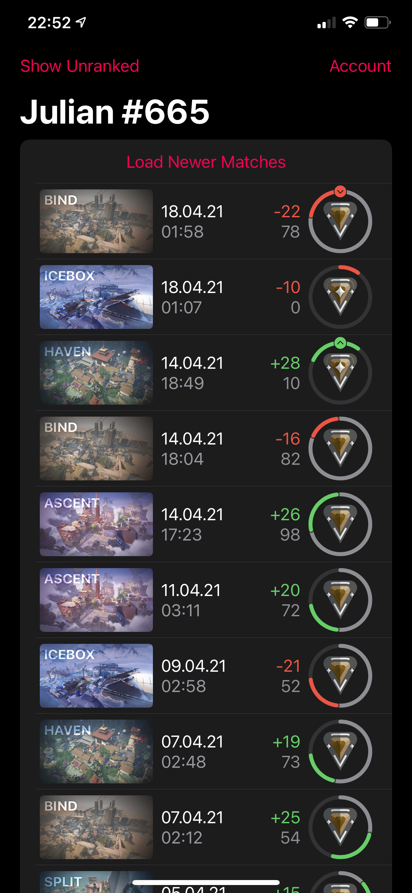

# Valorant Viewer

###### A tiny SwiftUI app to let you view your underlying competitive rating changes.

Based on [RumbleMike/ValorantStreamOverlay](https://github.com/RumbleMike/ValorantStreamOverlay), using their assets (for ranks & maps) and interaction strategy for Valorant's Client API.

