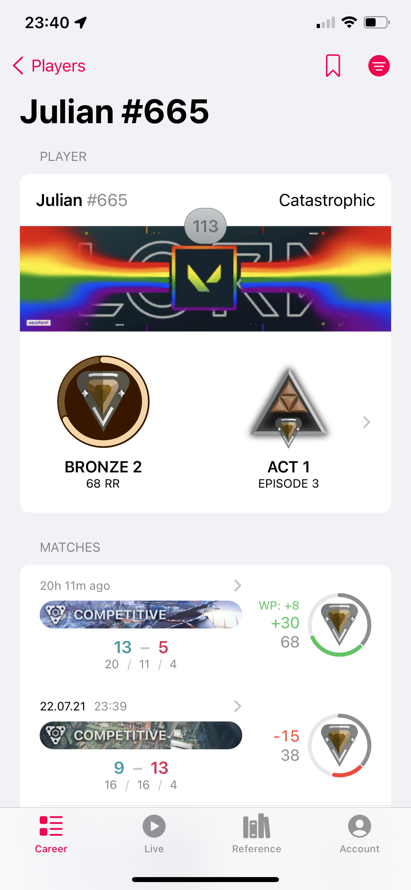
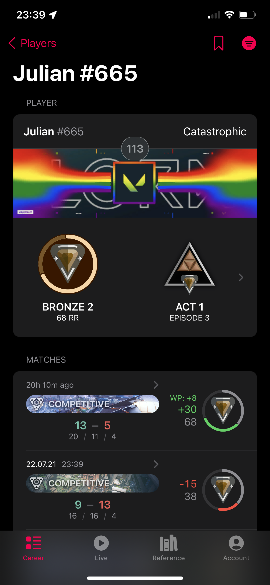
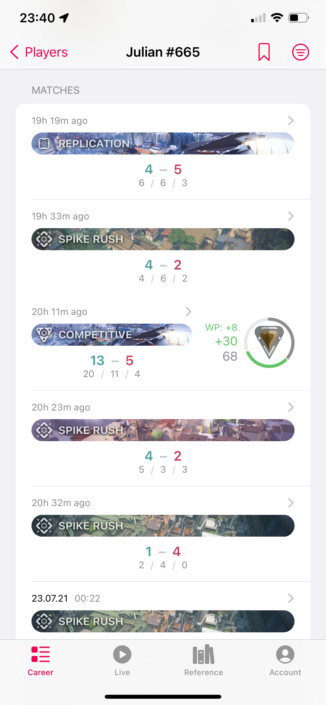
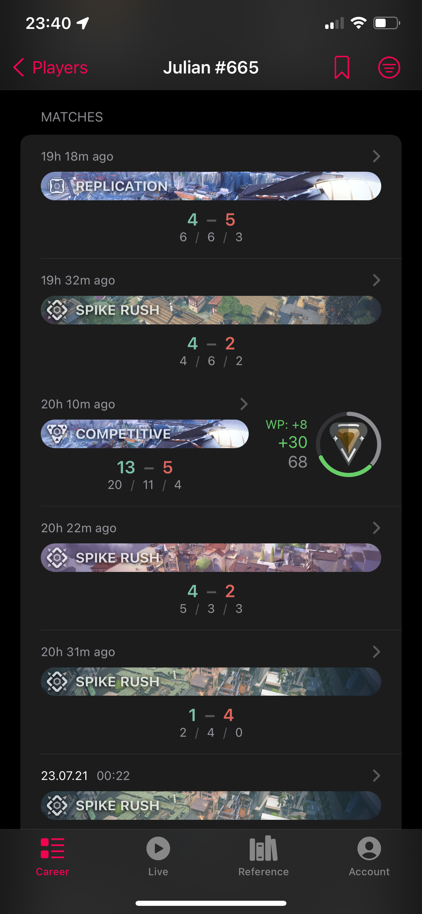
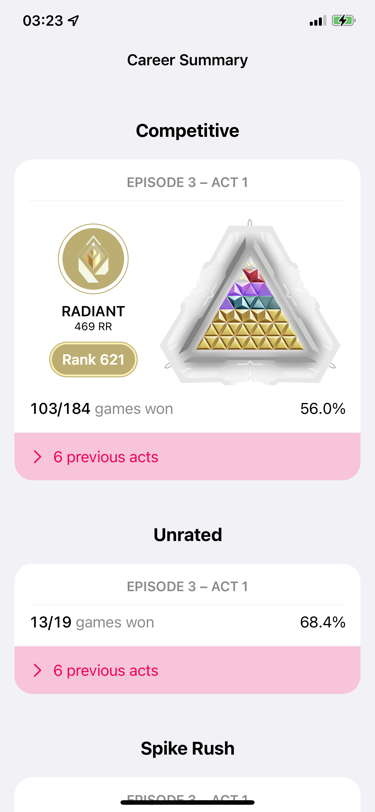
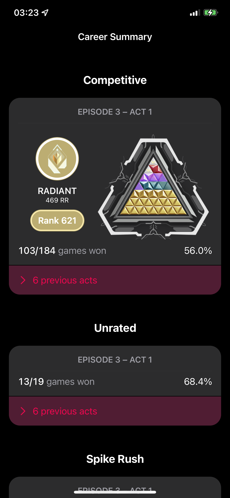
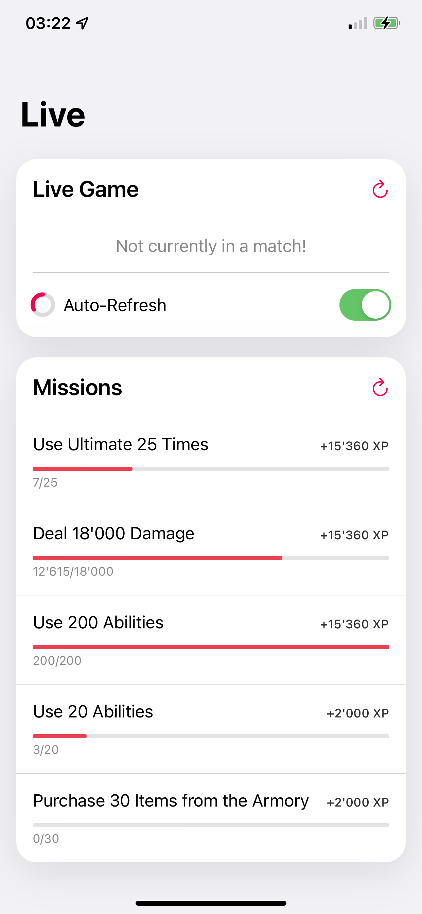
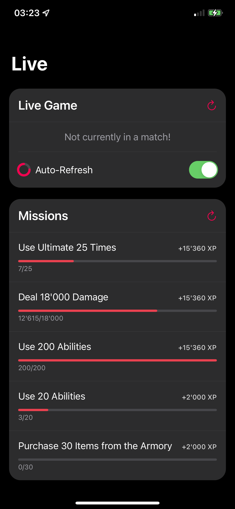

  

# Recon Bolt

This app started as a way to view your competitive rank changes (back before the numbers were visible) and has now evolved into so much more, even allowing you to participate in agent select from your phone. Check out the screenshots for a clearer overview than I could ever give in words!

Unfortunately, this app needs your Riot username and password to function, but of course you can view the code yourself to check its safety, and the password is stored in the keychain rather than as plaintext.

## TestFlight

I've uploaded a build of the app to Apple and they approved it for beta testing! [Here's the link](https://testflight.apple.com/join/M1e2dgxj) to join the beta :)

## Screenshots

(Some of this data is mocked, some is real—*can you tell which is which?*)

  
  

  
  

  
  

  
  

  
  

## Thanks

This project would not have been possible (or was significantly eased by) some prior work:

- **[RumbleMike/ValorantStreamOverlay](https://github.com/RumbleMike/ValorantStreamOverlay)** provided the initial inspiration (and even just let me know it was possible).
- **[RumbleMike/ValorantClientAPI](https://github.com/RumbleMike/ValorantClientAPI) and the associated Discord**: This has some nice docs and a great community for working with the API I need.
- **[colinhartigan/valclient.py](https://github.com/colinhartigan/valclient.py)** has filled in where the above docs were incomplete, providing a simple reference of what endpoints exist and how they're accessed.
- **[Valorant-API.com](https://valorant-api.com)** has proven to be a truly invaluable API, serving up the game's assets in an easy-to-use format. They were also wonderfully open and responsive to feature/change requests.
